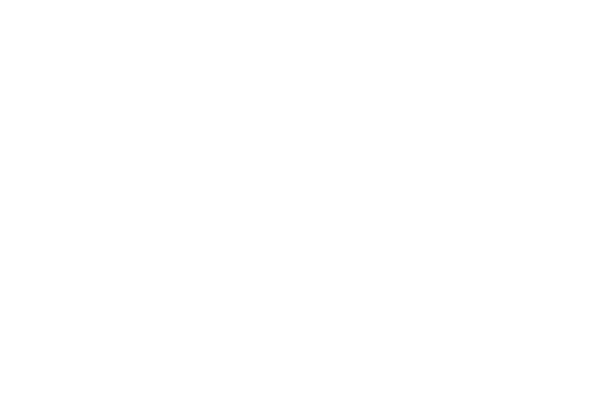

<!-- THIS FILE IS AUTO-GENERATED FROM INDEX.HTML -->
---
title: "Velantor Systems"
description: "Engineering team focused on machine learning and applied AI"
domain: "pager.joodaloop.com"
---

# Velantor Systems

A data-driven development studio

We’re an engineering team focused on machine learning and applied AI, with strong web development to deliver complete, usable products. We ship ML-driven POCs in about a week. From research-inspired prototypes to production-scale ML systems and full-stack applications, we build end to end.

[work](#work) [linkedin](https://www.linkedin.com) [email](mailto:hello@velantor.systems)

## work

### Entity Linking Problem for Narad

• Data Problem • Machine Learning • DataBase

### Entity Linking Problem for Narad

• Data Problem • Machine Learning • DataBase

### Entity Linking Problem for Narad

• Data Problem • Machine Learning • DataBase

### Entity Linking Problem for Narad

• Data Problem • Machine Learning • DataBase

### other projects

### Entity Linking Problem for Narad

• Data Problem • Machine Learning • DataBase

Narad - an analytics based fund approached us with a fascinating problem. In their comprehensive data repository that contains analysts and the companies they work for contains many duplicates and company resolution conflicts. After many iterations to deduplicate data, we came upon an optimal heuristic to link the related entities and helped Narad to have a cleaner dataset.

### Entity Linking Problem for Narad

• Data Problem • Machine Learning • DataBase

Narad - an analytics based fund approached us with a fascinating problem. In their comprehensive data repository that contains analysts and the companies they work for contains many duplicates and company resolution conflicts. After many iterations to deduplicate data, we came upon an optimal heuristic to link the related entities and helped Narad to have a cleaner dataset.

### Entity Linking Problem for Narad

• Data Problem • Machine Learning • DataBase

Narad - an analytics based fund approached us with a fascinating problem. In their comprehensive data repository that contains analysts and the companies they work for contains many duplicates and company resolution conflicts. After many iterations to deduplicate data, we came upon an optimal heuristic to link the related entities and helped Narad to have a cleaner dataset.

### Entity Linking Problem for Narad

• Data Problem • Machine Learning • DataBase

Narad - an analytics based fund approached us with a fascinating problem. In their comprehensive data repository that contains analysts and the companies they work for contains many duplicates and company resolution conflicts. After many iterations to deduplicate data, we came upon an optimal heuristic to link the related entities and helped Narad to have a cleaner dataset.

### Entity Linking Problem for Narad

• Data Problem • Machine Learning • DataBase

Narad - an analytics based fund approached us with a fascinating problem. In their comprehensive data repository that contains analysts and the companies they work for contains many duplicates and company resolution conflicts. After many iterations to deduplicate data, we came upon an optimal heuristic to link the related entities and helped Narad to have a cleaner dataset.

### other projects

### Entity Linking Problem for Narad

• Data Problem • Machine Learning • DataBase

Narad - an analytics based fund approached us with a fascinating problem. In their comprehensive data repository that contains analysts and the companies they work for contains many duplicates and company resolution conflicts. After many iterations to deduplicate data, we came upon an optimal heuristic to link the related entities and helped Narad to have a cleaner dataset.